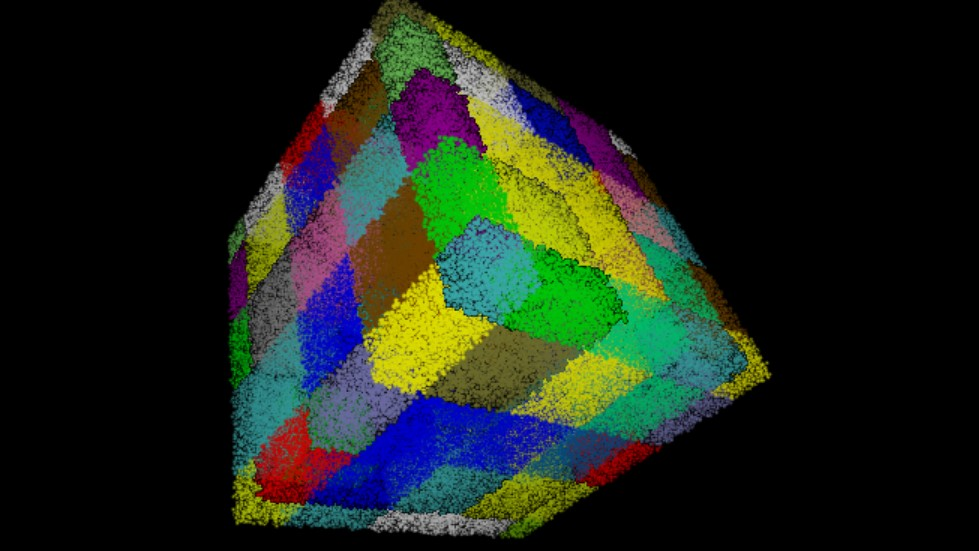

Cell lists or cell linked-lists are classic data structure used in molecular dynamics to reduce the computational cost of finding all interacting pairs within a given cut-off from O(N^2) to O(N). It can be used together with Verlet neighbor lists.

This crate include `cell_list` and `cell_list_3d_points`. 

`cell_list` is a generic implementation of the structure that does not store a any source data and does not know anything about the 3D nature of the problem.

`cell_list_3d_points` includes a reference to the points array and require simulation volume parameters to build the structure.

## Refs

> Allen; Tildesley. Computer Simulation of Liquids.

## License

Licensed under either of

 * Apache License, Version 2.0
   ([LICENSE-APACHE](LICENSE-APACHE) or http://www.apache.org/licenses/LICENSE-2.0)
 * MIT license
   ([LICENSE-MIT](LICENSE-MIT) or http://opensource.org/licenses/MIT)

at your option.

## Contribution

Unless you explicitly state otherwise, any contribution intentionally submitted
for inclusion in the work by you, as defined in the Apache-2.0 license, shall be
dual licensed as above, without any additional terms or conditions.
